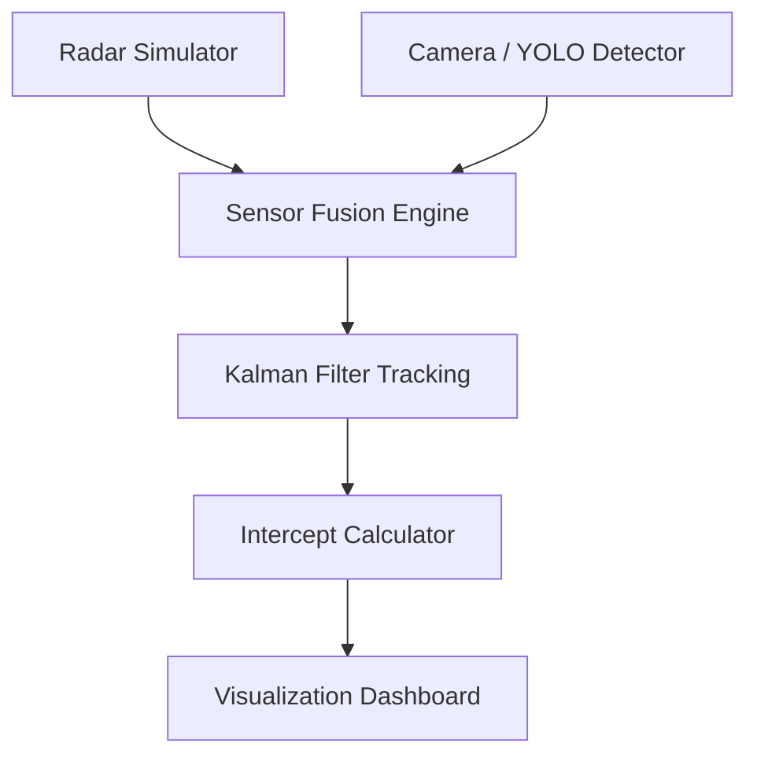

# IronDome-MDV: Simulated Aerial Threat Detection & Tracking System

> [!WARNING]
> **DISCLAIMER: This is a small-scale university concept project built as an academic proof-of-concept to explore sensor fusion and real-time tracking. It is NOT a functional weapons system.**

## 📖 Problem Statement
Modern aerial defense requires integrating multiple noisy data streams (e.g., radar, computer vision) to maintain accurate tracks on highly maneuverable targets. This project explores a simulated pipeline incorporating YOLO-based computer vision and Kalman Filter kinematics tracking to demonstrate basic sensor fusion and intercept geometry.

## 🏗 System Architecture

## 🛠 Technologies Used
- **Python 3.10+**
- **Ultralytics YOLOv11 / YOLOv8** for Computer Vision Detection
- **NumPy** for Matrix Mathematics and Filtering
- **OpenCV** for Simulation Rendering

## 🧮 Mathematical Models
### Kalman Filter
The system models target kinematics using a discrete-time linear Kalman Filter:
- State Vector: `X = [x, y, vx, vy]^T`
- Predict Step: `X_pred = F * X_prev`, `P_pred = F * P_prev * F^T + Q`
- Update Step: `K = P_pred * H^T * (H * P_pred * H^T + R)^-1`

### Intercept Geometry
The naive intercept calculation assumes a constant-velocity interceptor and target, deriving the intersection point algebraically. 

## 📊 Simulation Results
- Successfully tracked simulated targets amidst Gaussian noise.
- Maintained track continuity when CV detections dropped frames (thanks to the Kalman Filter prediction step).
- Fused Threat Assessment correctly classified drones vs fixed-wing aircraft based on simulated speeds and YOLO classifications.

## 📚 Academic References
1. Kalman, R. E. (1960). "A New Approach to Linear Filtering and Prediction Problems." *Journal of Basic Engineering*.
2. Redmon, J., et al. "You Only Look Once: Unified, Real-Time Object Detection." *CVPR*.
